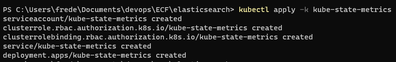
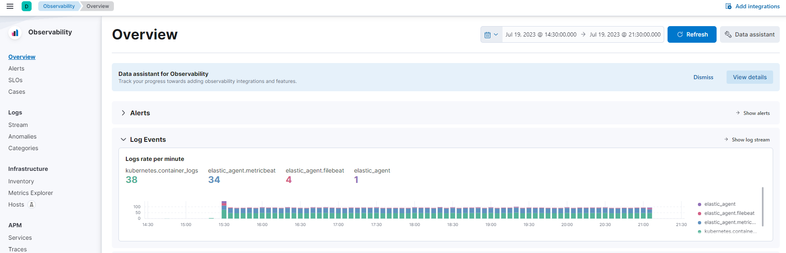
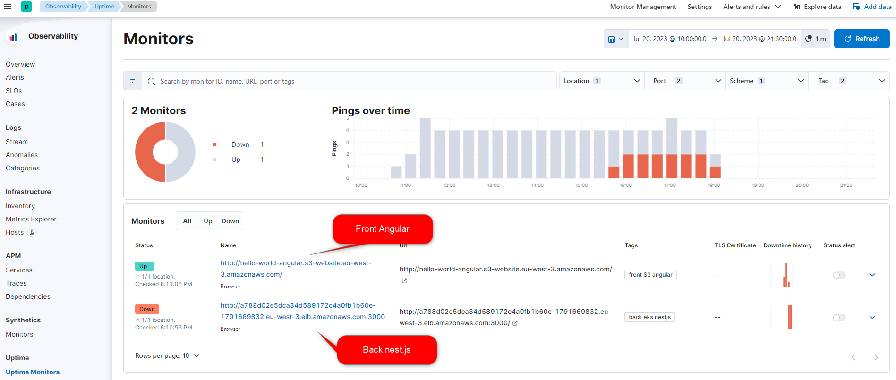

# ECF-Supervision

# ECF Hello World (NestJS)
📅 [**Planning Notion**](https://mirror-paw-f24.notion.site/f2fa7cecae5a4cd4a1792bf963ec744a?v=b71bd3754f5541c1a7c1a23cbb2f1ca9) 📅  
___ 
## Table of content
- [ECF-Supervision](#ecf-supervision)
- [ECF Hello World (NestJS)](#ecf-hello-world-nestjs)
  - [Table of content](#table-of-content)
  - [Activité Type 3 : Supervision des services déployés](#activité-type-3--supervision-des-services-déployés)
    - [1. Mettez en place un Elasticsearch et connectez-le au kubernetes](#1-mettez-en-place-un-elasticsearch-et-connectez-le-au-kubernetes)
      - [2. Mettez en place un kibana et connectez-le au élasticsearch. Montrez des exemples de recherches sur les logs (kibana queries)](#2-mettez-en-place-un-kibana-et-connectez-le-au-élasticsearch-montrez-des-exemples-de-recherches-sur-les-logs-kibana-queries)
  - [Sources utilisées](#sources-utilisées)

## Activité Type 3 : Supervision des services déployés  

### 1. Mettez en place un Elasticsearch et connectez-le au kubernetes  

- Utilisation d'elastic cloud (essai de 14 jours gratuits).  
On dispose d'une instance avec la stack Elasticsearch + kibana + Logstash.  
On peut alors créer et déployer un agent (en tant que DAemonSet) dans notre cluster aws eks, afin d'envoyer les metrics à notre compte kibana.  
On peut procéder ainsi (voir [documentation officielle](https://www.elastic.co/guide/en/fleet/8.8/running-on-kubernetes-managed-by-fleet.html#running-on-kubernetes-managed-by-fleet))  
  

- Une fois l'agent déployé dans notre cluster Kubernetes, on commence à recevoir des logs dans Elasticsearch   

- Ajout dans elastic de 2 monitors (Single Page Browser Test). Un premier pour le front Angular, et un deuxième pour le back nestjs.  
Ces monitors envoients des requêtes http, afin de voir si la page répond correctement. 
  
(Les Alertes présentes sur cette capture correspond aux instant où j'avais coupé volontairement les instances)

#### 2. Mettez en place un kibana et connectez-le au élasticsearch. Montrez des exemples de recherches sur les logs (kibana queries)

## Sources utilisées  

[Run Elastic Agent on Kubernetes managed by Fleet](https://www.elastic.co/guide/en/fleet/8.8/running-on-kubernetes-managed-by-fleet.html#running-on-kubernetes-managed-by-fleet)  
[Kibana Query Language](https://www.elastic.co/guide/en/kibana/current/kuery-query.html)